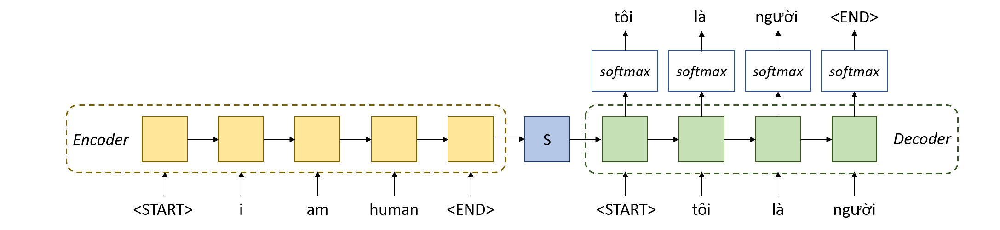
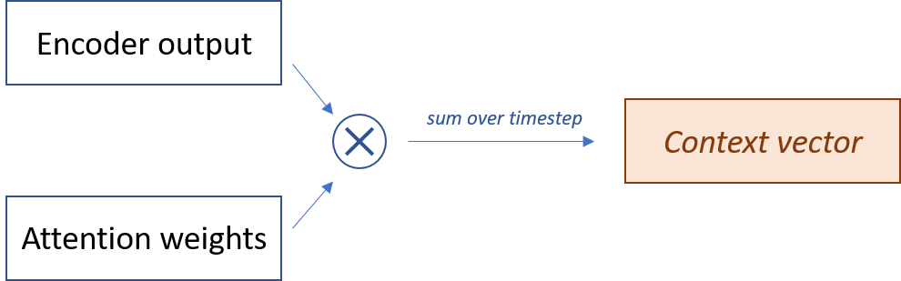
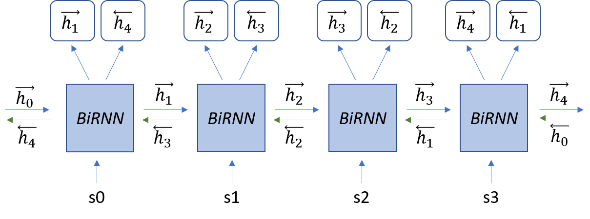

# Neural machine translation
In this repository, I implemented an English-Vietnamese translation model. The concepts behind this implementation are from the paper [Neural Machine Translation by Jointly Learning to Align and Translate](https://arxiv.org/abs/1409.0473), but with some slight modifications. I used PyTorch as my Deep Learning framework for this repository.

## Overview
### Dataset
To build my model, I used the preprocessed data [IWSLT'15 English-Vietnamese data [Small]](https://nlp.stanford.edu/projects/nmt/) from Stanford NLP Group. Training sentence pairs are store in `train.en` (English) and `train.vi` (Vietnamese), which consist of 133K sentences in each file. The validation set is taken from `tst2012.en` and `tst2012.vi` (1.5K pairs), test set is from `tst2013.en` and `tst2013.vi` (1.2K pairs).

### Seq2seq model
It is a Encoder-Decoder architecture, in which the Encoder takes the input features and passes its output to the first RNN unit of the Decoder. The Decoder will generate sentences word by word. Here is a simple illustration of the Seq2seq model:

In Seq2seq model, both Encoder and Decoder are Recurrent Neural Networks.

### Attention
At each timestep, the Attention network will compute the weights for all hidden states of the Encoder output. The Decoder will pay more attention to the states with bigger weights.

After that, Attention will produce a context vector, which is the weighted sum of the Encoder output

## Implementation
### Sentence preprocessing
For any raw text problems, we must firstly preprocessing them. In this project, since there are a lot of sentences with hundreds of words in the dataset, I care about sentences with 20 words and below (both English and Vietnamese sentences). As a familiar process, I remove all punctuation and digits from sentences, then lower all of them. Then add `<START>` and `<END>` tokens to each sentence and extend them to the same size with padding.

### Encoder
I chose to use bi-directional GRU for my Encoder, which takes both forward and backward outputs into account. By this, the annotation for each word is not only from the preceding words, but also from the following words. The **bi-directional RNN** looks like this.

According to the original paper, the last forward hidden state will be fed into the first unit of Decoder. In my project, I modified it a little by combining the last forward hidden state and the last backward hidden state before feeding into the Decoder.

### Decoder
Different than the Encoder, Decoder only uses **uni-directional RNN**, in this project I use GRU for Decoder. At every timestep, the input to Decoder's GRU is the concatenation of embedded input word and the context vector from Attention network.

### Training
I trained my model using CrossEntropyLoss as my loss function, and Adam as the optimizer. And I decrease my learning rate by 0.2 times every epoch using lr_scheduler from PyTorch. At training phase, **teacher forcing** is used, which means that the input words fed into Decoder model are taken from the ground-truth train captions, not from our prediction.

### Inference
At test time, **teacher forcing** is not used because we don't know the ground-truth captions yet. So at each timestep, the input to the Decoder are taken from previous prediction.
